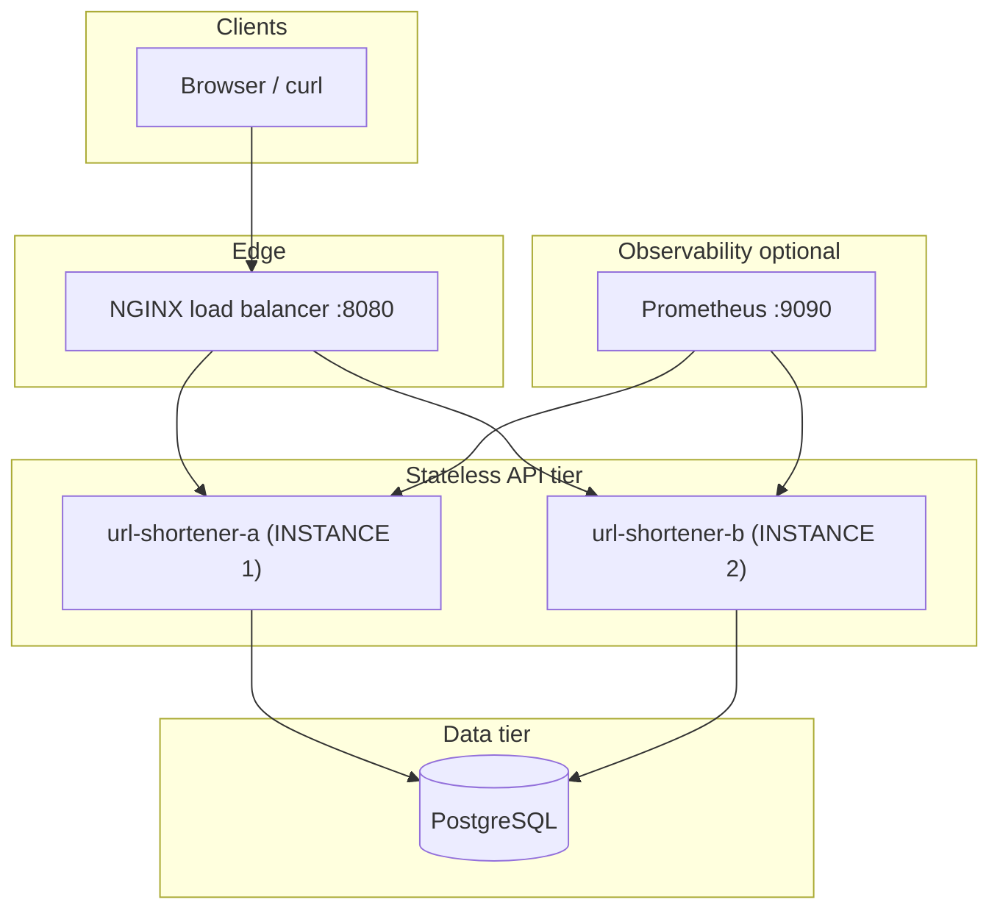

# Architecture

This document describes how the PE Hackathon 2026 stack is wired for **local development** and what would change in **production**. It reflects patterns common in distributed systems: stateless app replicas, edge proxy, health separation, and observability hooks.

## High-level diagram

## Request path

1. Traffic hits **NGINX** on port **8080** (published from container port 80).
2. NGINX balances across **two Gunicorn** processes (`least_conn`), reuses upstream connections (**HTTP keepalive**), applies **per-IP rate limiting**, forwards **proxy headers**, and propagates or generates **correlation IDs** (`X-Request-ID`).
3. Each **Flask** replica is **stateless**; shared state lives in **PostgreSQL** (and optional cache not included here).

## Health checks (Kubernetes-style)

| Endpoint | Role | Expected when |
|----------|------|----------------|
| `GET /live` | **Liveness** | Process should stay running; returns **200** if the Python/Gunicorn stack accepts HTTP. |
| `GET /ready` | **Readiness** | Returns **200** only if **PostgreSQL** answers `SELECT 1`. **503** if the DB is down — orchestrators should **stop routing** traffic (not necessarily kill the pod). |
| `GET /health` | **Human / legacy** | DB + circuit breaker + `instance_id` in one JSON payload. |

**Docker Compose** uses **`/live`** for `HEALTHCHECK` so a DB outage does not cause an unhelpful restart loop. The **load balancer** waits until both API containers report **healthy** before starting (so NGINX does not proxy to processes that are not listening yet).

### Docker inspect (restarts)

When you `docker inspect` a container:

- **`State.Restarting: false`** on an **exited** container is **normal**. That field is only **`true` for a short time** while the engine is actively performing a restart. Once the process has fully stopped, you see **`Status": "exited"`** and **`Restarting": false`** until the next transition.
- **`HostConfig.RestartPolicy`** (e.g. **`Name": "always"`**) is what actually enables automatic recovery — not the `Restarting` boolean.
- **`RestartCount`** on a **dead** container is the number of times **that container ID** was restarted. It can stay **`0`** if Compose replaced the service with a **new** container (new ID) instead of recycling this one — check **`docker compose ps`** for the current running task.
- **`ExitCode": 137`** with **`OOMKilled": false`** usually means **`docker kill`** (SIGKILL), not out-of-memory.

### If a replica stays `Exited` after `docker kill`

**Two different mechanisms:**

| Mechanism | What it does |
|-----------|----------------|
| **Engine restart policy** (`restart: always` in compose → `HostConfig.RestartPolicy`) | The **Docker daemon** is supposed to start a new container process when the old one exits. |
| **Compose reconciliation** | Running **`docker compose up -d …` again** asks Compose to **match** the compose file: start or recreate services that are not **Up**. This works even when the engine **did not** auto-restart. |

On **Docker Desktop for Windows** (and some **moby** builds), engine-level auto-restart is **unreliable** after **`docker kill`**, reboot, or certain signals — there are long-standing reports in **docker/for-win** and **moby/moby**. Your compose file can be correct (`RestartPolicy.Name: always`) and the container may still sit in **`exited`**. That is **not** something Flask or Gunicorn can fix: **`docker kill`** sends **SIGKILL** to the whole container; only the **daemon** (or a new `docker compose up`) can bring it back.

**What to do (in order):**

1. **Reconcile with Compose** (most reliable on Desktop): from the repo root,  
   `docker compose up -d url-shortener-a url-shortener-b`  
   Or run **`scripts/ensure-api-replicas.ps1`** / **`scripts/ensure-api-replicas.sh`** (same command).

2. **Prefer detached mode** for normal dev: `docker compose up -d --build`, then `docker compose logs -f …`. Foreground `docker compose up` (no `-d`) can interact badly with lifecycle on some setups.

3. **Recreate** if you changed compose or images:  
   `docker compose up -d --force-recreate url-shortener-a url-shortener-b`

4. **Force the engine policy** on an existing container (if inspect ever shows `RestartPolicy.Name` empty or `no`):  
   `docker update --restart=always <container_name>`

5. **Diagnostics**: In another terminal, run `docker events --filter container=<name>` while you kill the replica — you should see **die** / **restart** / **start** if the engine is retrying. If there is **no** restart activity, use step 1. If the container **flaps** (**Restarting** / crash loop), read **`docker compose logs url-shortener-a`** — that is an **app** exit, not a missing restart policy.

6. **Upgrade Docker Desktop** if you are on an older 4.x build; restart-policy bugs are fixed incrementally.

## Load balancing behavior

- **Algorithm:** `least_conn` — good default when request duration varies.
- **Sticky sessions:** not enabled. Same client may hit different replicas on each request; set **`ip_hash`** in NGINX if you need affinity (tradeoff: potentially uneven load).
- **NGINX `stub_status`** on **8081** is **edge connection** stats only, not application SLOs.

## Metrics

- **Application:** `GET /metrics` (Prometheus text) on each replica, including `http_requests_total{instance_id="..."}`.
- **Prometheus** (optional service) scrapes **`url-shortener-a:5000`** and **`url-shortener-b:5000`** on the Docker network — **not** via NGINX — so you get **one time series per replica** without aggregation at the LB.
- **Gunicorn multiple workers:** each worker has its own in-memory Prometheus registry unless you enable **multiprocess** mode (see `url-shortener/README.md`).

## What “production” adds (and what exists in this repo)

| Topic | In-repo reference |
|-------|-------------------|
| **TLS + HSTS** | `docker compose -f docker-compose.yml -f docker-compose.tls.yml up --build` — HTTPS on **localhost:8443** (self-signed cert baked in `load-balancer/Dockerfile.tls`; HSTS on HTTPS). Plain HTTP remains on **8080**. |
| **Secrets vault** | Not automated here (use your platform’s Secret store + sealed secrets in CI/CD). |
| **Autoscaling** | `k8s/hpa-url-shortener-a.yaml` / `k8s/hpa-url-shortener-b.yaml` (CPU/memory; requires metrics-server). Cloud Run / ECS use their own autoscalers with the same signals. |
| **JSON logs + trace IDs** | Set `LOG_FORMAT=json` (see `url-shortener/.env.example`). Middleware emits `request_id` / `trace_id` fields for correlation with `X-Request-ID` / NGINX `rid=`. |
| **Alerting (SLO-style)** | `prometheus/rules/slo.yml` (5xx rate, 429, scrape health, p99 latency from `http_request_duration_seconds`). **Alertmanager** on **:9093** (`alertmanager/alertmanager.yml` — replace webhook for real paging). |
| **Database backups** | `db-backup` service in `docker-compose.yml` (scheduled logical dumps to volume `pg_backups`). |
| **Replication + migration strategy** | `infra/postgres/replication-notes.md`. SQL migrations: `url-shortener/migrations/` + `url-shortener/scripts/apply_migrations.py`. |
| **Edge HA** | `docker compose -f docker-compose.yml -f docker-compose.ha.yml up --build` — second NGINX on **8082** (same upstream pool; simulates DNS round-robin / external GLB). **`k8s/ingress-url-shortener.yaml`** shows TLS at the ingress controller. |

## Repository layout

| Path | Responsibility |
|------|----------------|
| `load-balancer/` | `nginx.conf` (HTTP), `Dockerfile` / `Dockerfile.tls` + `nginx.tls.conf` (HTTPS + HSTS) |
| `prometheus/` | `prometheus.yml`, `rules/slo.yml` (Alertmanager rules) |
| `alertmanager/` | `alertmanager.yml` |
| `docker-compose.yml` | Compose stack (API replicas, LB, Prometheus, Alertmanager, `db-backup`) |
| `docker-compose.tls.yml` / `docker-compose.ha.yml` | Optional TLS + second edge NGINX |
| `k8s/` | Full stack via `kubectl apply -k k8s/` (Postgres, API `a`/`b`, LB, Prometheus w/ pod SD, Alertmanager, CronJob backup, static UIs, HPA); see `k8s/README.md`. Optional `ingress-url-shortener.yaml`. |
| `infra/postgres/` | Replication / DR notes |
| `url-shortener/` | Flask app, Gunicorn, Peewee, metrics, `migrations/`, `scripts/apply_migrations.py` |
